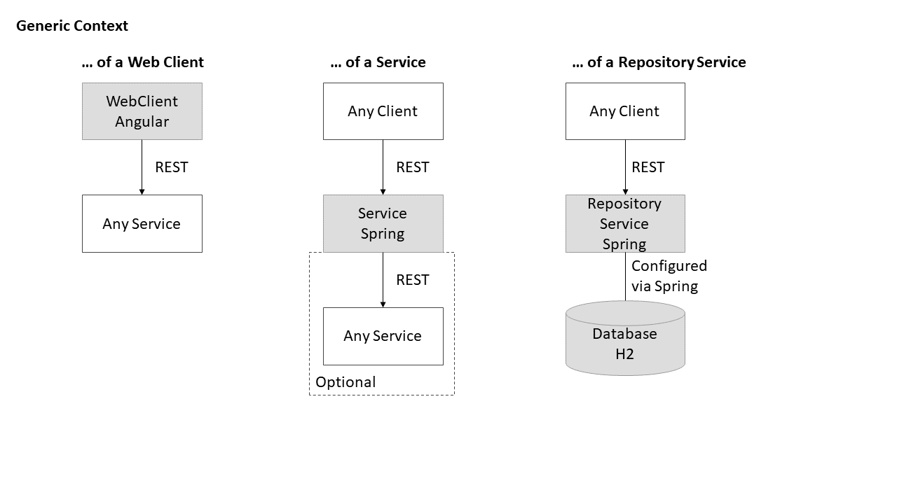
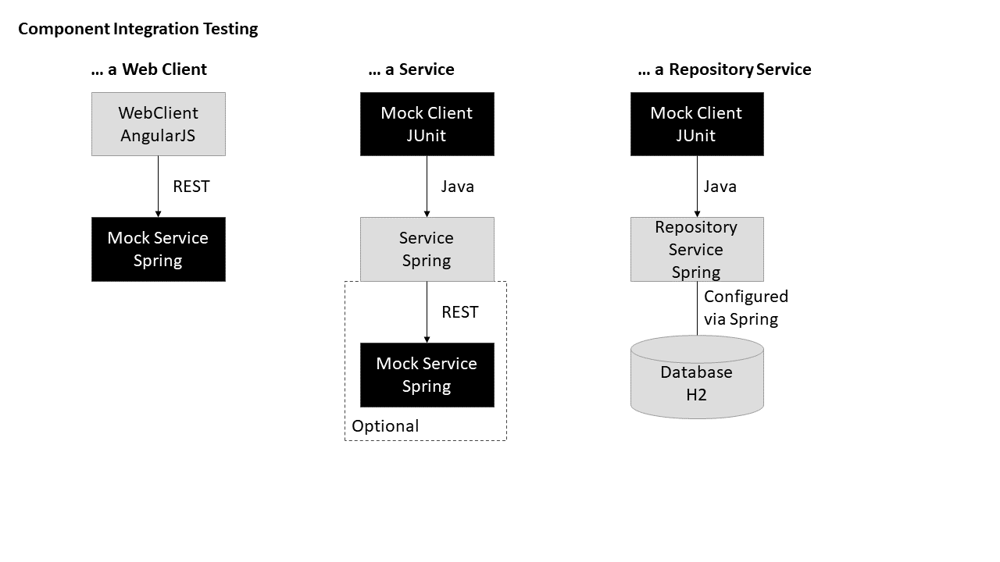
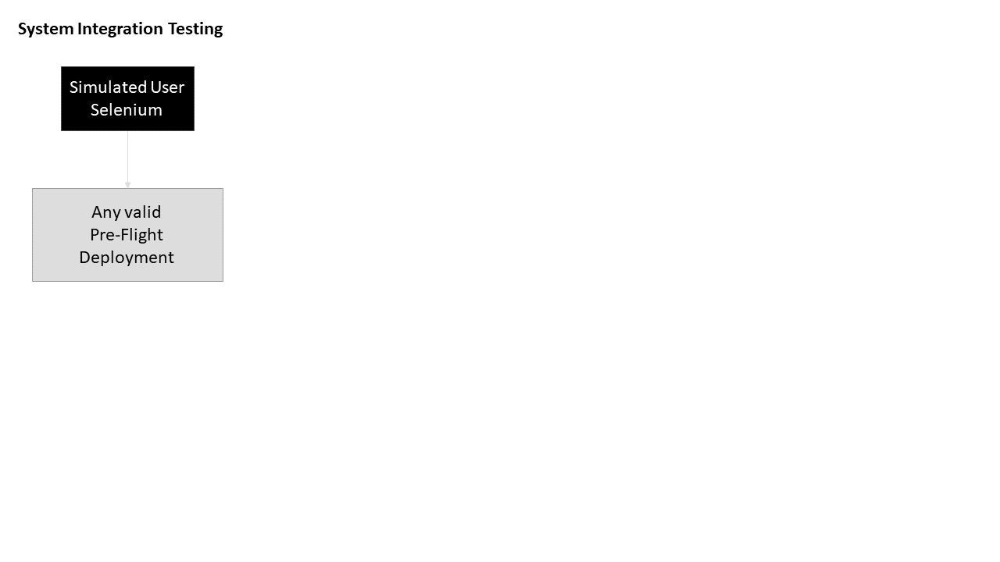
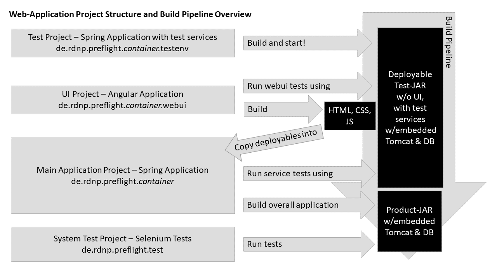

# Pre-Flight Architecture Documentation

## 1. Requirements and Goals

The goal of _Pre-flight_ is:

* Open source reference architecture clearly documenting all interfaces between flight planning tools and external services, such as weather providers
* Open source tools that can be used to educate people on the functionality of each one of the tools around the flight planning that have been implemented
* Supporting pilots like me in planning VFR and IFR flights correctly and efficiently in a semi-automated manner

From this, the need to support the following quality goals arises:

* Correctness: Especially critical computations must be 100 % correct. All software will be tested with appropriate testing techniques, tests will also be published along with the software.
* Transparency: All computations will be done in a way that the user sees what is happening. For instance, the exact data sources will be mentioned by the software. This is also complementing the open source character of the software.
* Maintainability, Portability and Extensibility: The software will be designed in a way that parts can be easily exchanged and deployed elsewhere.

### 1.1 Major Use Cases

At a high level, features of the software will include:

1. Planning a flight route in a semi-automated manner using a paper map considering aircraft performance and the weather along the route
1. Managing printouts of approach plates needed for a flight (esp. IFR)
1. Weight and balance computations for airplanes
1. Computing the take off and landing run
1. Creating a weather briefing
1. Planning a flight route in a semi-automated manner using a list of points considering aircraft performance and the weather along the route
1. Route discovery between airports
1. Generating flight plans for filing

## 2. Constraints and Conventions

* The software must be shippable in a first version by end of 2019, this restricts the project capacity to 12 person days
* All tools included must be non-commercial and non-GPL
* All tools produced by the project must be accessible through a web browser with no installation required by the end users

## 3. System Context


## 4. Solution Strategy

The key drivers behind the strategy behind Pre-Flight are:

* Education - Creating of a clearly documented and understandable reference architecture for flight planning tools
* Business value - Automating the most time-consuming activities in the manual flight planning process
* Easy access - All tools are web-apps that are accessible from any system relying only on a web browser
* Transpacency on actions performed and data used by the software to the user so that errors (e.g. invalid / outdated data) can be easily detected
* Modularization - Leaving extension points for further automation (e.g. easy replacement of initially manual inputs by data from web services)

### 4.1 Technology Strategy

To reduce the variation in technology, the entire architecture of Pre-Flight will be composed only of three types of technical building blocks:

* Web-clients, exposing a UI to the user - those are implemented using [Angular](https://angular.io/start). They consume services (including repository services) for accessing and storing data.
* Services, providing business logic behind a REST interface - those are implemented either using [Spring RESTful Services](https://spring.io) or Angular services (on client-side)
* Repository Services, giving access to a contained database through a REST interface  - those are implemented using [Spring Repository for the H2 database](https://spring.io)



Notes. 

1. For Angular services to access REST services, exactly one access service is created as Angular service. This particular type of service will *not* be depicted as a separate component in this document. As it acts only as a forwarder and for data transformation on the way, it will be regarded as part of the requesting component, which is another Angular client or service. 

1. Angular services cannot be used by REST services, they can be used by Angular components or other Angular services.

1. The database of a Repository service will not be regarded as a separate component in this document. 

Each building block corresponds to a component in chapter 5. See chapter 8 for details on how each one of those is implemented in detail. For details on why those technologies have been chosen, see chapter 9. 

### 4.2 Test Strategy

Three levels of testing are relevant for the development: 

* Unit testing
* Integration testing of a component
* System testing of a deployable overall product

For unit and component level testing, the following frameworks are used:

* Karma / Jasmine for the WebClient part
* JUnit for the REST interfaces exposed by services

For system level testing, Selenium is used.

The development follows a test-driven approach. This entails that unit tests are created as part of the development process.

For component-level tests, a Mock component is developed in parallel to the counterpart requiring the interface. For example, while developing a web client that requires to use a particular REST service, the corresponding mock service is developed. The mock services are developed as regular self-contained Spring REST services. The mock clients are developed in JUnit, exploiting the Java interface declaring the REST operation in Spring's code. Mock client and mock service development will be part of the development process of the interfaces.



For system-level tests, Selenium tests are created, one for each use case. This can be started as early as the UI for a use cases is defined, and before the respective business logic is in place.



### 4.3 Delivery and Deployment Strategy

The project structure and the delivery pipeline is shown below for an example application containing web clients and services.



Generally, the build process first builds the integration test environment, containing of all mock services needed for testing. The integration test environment is immediately fired up. This way, the services from the test environment can be accessed during the testing phase of the web clients and the services. After this, the web clients are tested and built into HTML, CSS and JavaScript. These artifacts are immediately integrated into the main application project, which is built last. The build output is a deployable .jar file containing the web ui, production services, embedded Tomcat and the embedded database.

After the production artifact is available, the integration test environment is stopped and the production environment is started. The final build step comprises running the system tests against the production environment.

The build is designed as a Maven build, so that it can be easily triggered from Eclipse and from a CI pipeline.

## 5. System Decomposition View


### 5.1 Flight Planner


### 5.2 Approach Plate Manager


### 5.3 Aircraft Manager


## 6. Runtime View

### 6.1 Flight Planner

This section describes the basic interactions of the Flight Planner with the user and external systems.

Note. Currently, this section contains only the runtime view of the Flight Planner, the other parts of the system will be described later.

#### 6.1.1 Create Flight


#### 6.1.2 Delete Flight


#### 6.1.3 Open Flight


#### 6.1.4 Edit Flight

The following three diagrams describe example interactions of editing flight, route, and trip data.


In practice, these interactions may happen in parallel, opening and saving a diagram and selecting a trip can be triggered by the user at any time. More details on how the opening, saving and editing procedures are implemented can be found in the unit tests.

#### 6.1.5 Trip Computation

Computation of trip segments ("legs") happens online while the user enters data and is based on the following user inputs: 
 - True course (from route repository)
 - Distance (from route repository)
 - Magnetic variation
 - Fuel consumption rate
 - Wind (direction and speed)
 - True airspeed
 
The following derived values are computed for each leg and displayed always immediately after the user changes one of the relevant inputs:
 - Magnetic course
 - Magnetic heading
 - Ground speed
 - Time
 - Fuel
 
The following information may be provided by the user and is not used by the computation:
 - altitude

The following rules influence updating derived values based on user input:

1. Changes in true course (loaded from flight route repository) or magnetic variation trigger a re-computation of the magnetic course
1. Changes in magnetic course, wind or true airspeed trigger a re-computation of the magnetic heading
1. Changes in magnetic heading, wind or true airspeed trigger a re-computation of the ground speed
1. Changes in distance (loaded from flight route repository), or ground speed trigger a re-computation of the time
1. Changes in time, or fuel consumption rate trigger a re-computation of the fuel
1. Changes in altitude do not affect the trip computation

If the user enters a time value for any leg, this is treated as time limit for a part of the leg. The part is then segregated out into a new leg. This new leg can be edited by the user, e.g. a different wind or true airspeed can be entered for it. By setting the limit on the leg to zero, the user can merged the leg back into the main leg.

## 7. Deployment View

Currently, the deployment is handled by creating a single .jar file with a Spring application running on Spring's embedded Tomcat web server. It will serve the compiled version of the Angular applications, all Spring REST services and the REST part of all Repository Services. For storing data, the embedded Spring H2 database is integrated into this. Data will be written into a file in the same directory as the .jar file.

In future, more deployment scenarios will be created and documented here.

## 8. Cross-Cutting Concepts

### 8.1 Persistence Concept
Persistence is achieved through Spring repository services. Those communicate with the H2 database. This decision is documented in ADR-1.

An example how to implement a repository service for the H2 database can be found here: https://spring.io/guides/gs/accessing-data-jpa/

In addition, the following properties need to be added to an application.properties file of the project in "src/main/resources" folder (create one if needed):

```
spring.datasource.url = jdbc:h2:file:./flightdata/flightdb;DB_CLOSE_ON_EXIT=FALSE;
spring.jpa.hibernate.ddl-auto = update
```

This ensures that the data is written to a file and not discarded on application shutdown.

### 8.2 Service Concept
All services of pre-flight are either Angular services running on client side (see https://angular.io/guide/architecture-services) or REST services implemented using the Spring framework and grouped into Spring Applications. 

An example how to implement a Spring service can be found here: https://spring.io/guides/gs/rest-service/

One extension to this for pre-flight is that each REST service has an associated test service implementation. The intention is that the test instance is configured to a particular behavior before the test with an API the service provides. The test services are part of a test Spring Application. Each Spring Application has one associated test application, which is a separate Maven module. 

The test application and all test services are configured to support Cross-Domain requests so that the associated web clients and other services can run within a different server on the same node for testing. See this post for how to enable cross-domain requests (CORS): https://stackoverflow.com/questions/35091524/spring-cors-no-access-control-allow-origin-header-is-present

**Important Note**. CORS is not to be enabled on the productive Spring application.

### 8.3 Web Client Concept
All web clients are implemented as Angular components. 

The documentation of Angular can be found here: https://angular.io/start.

## 9. Architecture Decision Log

### ADR-1 Persistence Technology - Spring with H2

**Status**. Closed - 2019/12/08

**Context**. Pre-Flight needs to persist data of flight routes, aircraft performance, etc. There are various options available in the context of web applications:
* Many new web-apps use MongoDB. It is easy to install, should be sufficiently fast for the use case and amount of data, and has a strong community.
* Enterprise systems heavily rely on JEE technology with relational databases. Major options there are MySQL, PostgreSQL. Very fast. Need higher effort due to maintenance of schemas and installation.
* H2 database following JEE standard. It can be easily exchanged with another relational DB. It needs no installation, as it can be simply imported from Maven. H2 databases are also heavily used as test database for enterprise applications that rely on relational databases.

**Decision**. The decision is towards the H2 database. The H2 database is most easy to use (no installation), compatible with JEE and sufficient for development, and even for an initial deployment with few users.

**Consequences**. The application will not be able to switch to MongoDB easily if that would be needed for some reason (e.g. higher amount of users). It will be however possible with low effort to reconfigure the application to another relational database for productive deployment. This would then require the set-up of the new database.

### ADR-2 Front-End Technology - Angular
**Status**. Closed - 2019/12/08

**Context**. For the web-clients, a technology needs to be chosen. Options considered are:
* Google Web Toolkit - on the market since long time, in maintenance phase. Allows to code everything in Java with JUnit and generate JavaScript out of that. Less releases in the recent past, so there is a slight risk of outdating. Needs no specific IDE over what is already there for Java.
* Angular JS - very small in size, can be even simply imported in a JavaScript file. Needs no specific installation or IDE. Many applications on the market rely on AngularJS.
* Angular (aka Angular 2) - modern and currently in active development. Allows for responsive design out of the box and has a good structural framework for the code. Supports TypeScript as a language and test-driven development with Jasmine/Karma.
* HTML + CSS + JavaScript with some libraries - classical approach. Most easy to implement. Might make some more complex UIs hard to realize. Risks are that for some features and even ways of working (e.g. TDD) more research is needed.

**Decision**. Angular (aka Angular 2). Reason: Risk of getting outdated in the mid-term future is lowest and most features are available, minimizing the risk associated with additional low-level hacks or dependencies.

**Consequences**. Need to integrate the Angular application into the build process, need to install IDE plug-ins. Overall effort will increase by 3-4 days due to this. However, the benefits of being able to do things more easily later will pay off this initial invest.

### ADR-3 Deployment Format - Spring with Embedded Tomcat

**Status**. Closed - 2019/12/08

**Context**. This is about how to deliver the output of the project, the actual software. Options are the creation of .war files for deployment on a web application server and the use of Spring's embedded Tomcat and deploy one application as a single .jar

**Decision**. Use of Spring's embedded Tomcat, deploy one application as a single .jar.

**Consequences**. When multiple applications are available, this could lead to problems when running them on a single node. Either they need to run on different ports. This means that ports for the services required from other applications must be configurable and every application must be deployable on a different node, not relying on the others. If this is not ensured by the final solution, this decision needs to be revisited. It can be revised to building .war files, as Spring services can be deployed as .war files easily.

### ADR-4 Integration and System Test Strategy

**Status**. New - 2019/12/21

**Context**. Selenium-based testing vs. using Karma/Jasmine to automate testing at the UI level.

**Decision**. Not yet available

**Consequences**. Not yet available

## 10. Risks / Technical Debt

### Technical Debt #1 - Architecture Documentation as Part of Build

Description: The architecture documentation needs to be integrated in build pipeline. This way, it is ensured that always the current architecture documentation is exported from the model. In addition, the AD should be checked against the implementation in the model.

Status: New

Risk: Low

Comment: Risk is low as of now, as there is not yet much functionality in the application. Once interfaces become more and functionality is more complex, there will be a need for this.

Date found: 2019/12/07

### Technical Debt #2 - Support of Multiple Applications in Deployment

Description:  Deployment of multiple containers onto one or more nodes need to be defined. One idea could be the use of Docker containers. Another option would be to simply build one .war file for an application. This way, all applications could be deployed onto one web server.

Status: New

Risk: Low

Comment: Risk is low as of now, as there is only one application to be developed in the near future. Also, Spring's website says that building a .war file is easy, so at least one of the solutions will work out with low additional effort. 

Date found: 2019/12/07

### Technical Debt #3 - Modules of the Build are not Independent

Description: Currently, the overall build starts / stops the server at certain points. Best would be to modularize the build, so that every step can be executed without the one before. Especially tests need to start their test environment without user interaction. Currently, in case of some modules, the user needs to manually start the integration test server to run the build.

Status: New

Risk: Low

Comment: Risk is low as of now, as there are only very few components. If the build gets more complex, this could become an issue.

Date found: 2019/12/08

### Technical Debt #4 - Shutdown Hook on Productive Server

Description: There is a shutdown controller exposing a REST interface introduced to shutdown the integration test and production server during the build. While this is very good for the integration test server, it is not advisable for the production server. Either the hook must be removed or secured e.g. that only certain users can trigger it.

Status: New

Risk: High

Comment: Risk is high once the system goes into production as anyone could simply shutdown the service and make the system fail.

Date found: 2019/12/08

### Technical Debt #5 - Duplicate Code between Test Service and Production Service

Description: Currently there are code duplications between the test and production service. As the test service needs to be built first, as it will be used to test the production service, this is not too easy to resolve. A short-term workaround could be a sync script that overrides the source code in the test project with the one from the production project. Better would be to refer the code in some way.

Status: New

Risk: Medium

Comment: Should be resolved at least with a workaround once the implementation of the productive service starts.

Date found: 2019/12/08

### Technical Debt #6 - Handling of Errors on Repository Access

Description: There is currently no concept for handling errors when the repository is not accessible or when corrupt data is read from the repository. So the behavior of the application in such cases is not clear, it could stop working or display corrupt data.

Status: New

Risk: Low

Comment: The risk of this to cause errors is low, as the web client conducts validations to prevent corrupt data up-front. As of now, there is also no deployment scenario, where the repository is on a different node than the web server. Without such a deployment scenario, at least the network communication provides no risk.

Date found: 2019/12/21

### Technical Debt #7 - Multi-User Concept

Description: There is currently no concept for multi-user access. What is missing are (1) access control and (2) synchronization of the activities of multiple users. In particular, when the application is deployed on a node in the public Internet, the absence of access control would allow users to modify other user's data. This can make data for planning unreliable, as malicious users or robots could insert rubbish data, delete or modify existing data. 

Status: New

Risk: Medium

Comment: The risk of this to cause problems is medium, as for now, the application is used only in protected networks. In the long-term, a deployment under a public URL will come into picture. Before this, a concept for multi-user access needs to be developed.

Date found: 2019/12/21

### Technical Debt #8 - Deployment Nodes Configured prior to Build

Description: Currently, the URL of the repositories needs to be configured in a TypeScript file before the build. Without "hacking" the build artifact, it can also not be changed after the artifact has been produced.

Status: New

Risk: Low

Comment: As a temporary solution, the URL can be entered before each deployment. In the long-run, a concept should be developed for mapping the repository and the web application in an automated way.

Date found: 2019/12/21

### Technical Debt #9 - Waypoint Validation Concept for Flight Route

Description: It is currently possible to remove all points from a flight's route. When saving the flight after this, the data gets corrupted as the flight with no points can no longer be edited. Moreover, the user can create a route for a flight that does not start at the flight's origin and does not end at it's destination or alternate.

Status: New

Risk: Low

Comment: For now, this behavior can be documented in the user guide to avoid confusions.

Date found: 2019/12/21

## 11. Glossary

Flight. In the context of Pre-Flight, a flight is the plan of flying from an airport to another airport. It comprises information that remains constant across all execution instances ("trips") of this flight. It has a defined flight route.

Leg. A leg is a flown segment of a flight, it can refer to a route segment or a trip segment.

Point. A point is a location on earth.

Route Segment. A route segment connects two points. It stores the track in relation to true north, the distance, and the minimum safe altitude between the two points.

Trip. A trip is a single instance of conducting a flight on a day. It comprises information that is relevant for performing the flight on the day, such as the aircraft chosen, the weather, etc.

Trip Segment. All nformation needed for flying a route segment in a trip, such as the en-route weather, planned altitude, etc.